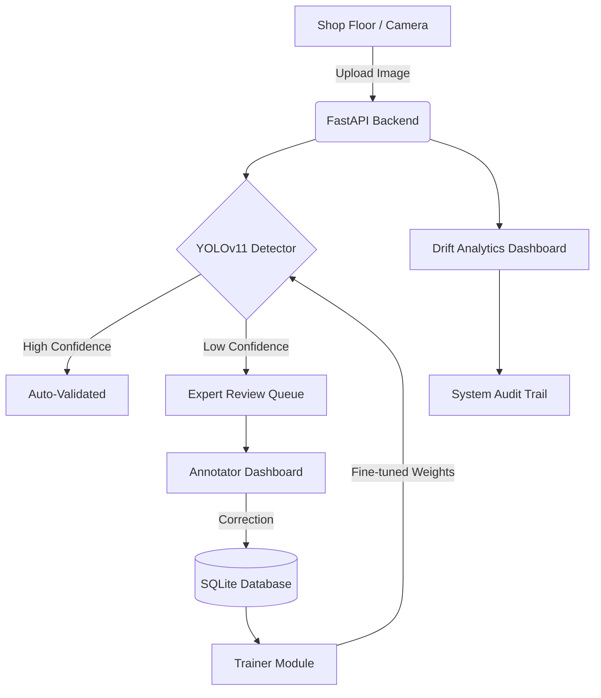

# Opti-Quality: Human-in-the-Loop Visual Inspection System

##  Project Name
**Opti-Quality: Human-in-the-Loop (HITL) Visual Inspection & Active Learning System**

---
/
 "Opti-Quality Core - Shop Floor View")
##  Problem Statement
In modern manufacturing, quality control requires high-speed and high-precision defect detection. However, static AI models often face two critical challenges:
1.  **Edge Cases**: Unusual defects or lighting conditions can cause model uncertainty, leading to false negatives (missed defects).
2.  **Model Drift**: Over time, changes in the production line (new materials, camera wear) cause the model's performance to degrade.

Relying solely on automated AI is risky, while relying solely on manual inspection is slow and unscalable. This system solves this by combining the speed of AI with the expertise of human inspectors.

---

##  Solution Overview
Opti-Quality is an end-to-end visual inspection system that implements an **Active Learning** workflow. It uses state-of-the-art vision models to automate 90%+ of inspections while routing "uncertain" cases to human experts. As experts verify these cases, the system uses that data to fine-tune itself, becoming smarter and more accurate over time.

---
## Project Structure
```text
Opti-Quality/
├── backend/            # FastAPI, Database, Detector, Trainer
├── frontend/           # Streamlit Web Dashboard
├── data/               # Persistent storage for images/labels
├── models/             # YOLO Weights and fine-tuned versions
├── scripts/            # Secondary simulation scripts
├── Dockerfile.backend  # Container config for API
├── Dockerfile.frontend # Container config for UI
├── docker-compose.yml  # Orchestration
└── run.py              # Single-command local startup
```


##  System Architecture
The system is built with a modern, microservices-ready stack:



-   **Frontend**: Streamlit with custom CSS (Glassmorphism design).
-   **Backend**: FastAPI for high-performance async processing.
-   **Database**: SQLite via SQLAlchemy (Audit logs, Config, Inspections).
-   **Messaging**: REST API (support for Docker networking).

---

##  Model Details
-   **Model**: YOLOv11 (Nano variant for high-speed inference).
-   **Pretrained or Fine-tuned?**: Starts as **Pretrained** (COCO weights) and is dynamically **Fine-tuned** via the dashboard's Active Learning loop.
-   **Dataset Size and Source**: 
    -   Initial: Ultralytics Pretrained weights.
    -   Active: Accumulates expert-reviewed images from the production line (min. 5-10 images required for local fine-tuning).
-   **Classes Detected**: `defect`, `fracture`, `stain`, `misalignment`.
-   **Confidence Thresholding Logic**: 
    -   Uses an **Explicit Threshold** (Default: 0.6).
    -   Any inspection where `max_confidence < threshold` is automatically flagged as `pending_review`.

---

##  Human-in-the-Loop Workflow
The HITL workflow ensures continuous quality improvement:
1.  **Inference**: AI scans the product.
2.  **Audit Check**: If the AI isn't certain, the case enters the **Annotator Queue**.
3.  **Human Audit**: An expert reviews the image, adjusts the label, and adds remediation notes.
4.  **Data Export**: The reviewed data is automatically formatted into YOLO-compliant labels.
5.  **Re-training**: The system fine-tunes the model on this "bottleneck" data, specifically learning from the cases it previously found difficult.

---

##  Evaluation Metrics
Current model performance (YOLOv11n baseline):
-   **mAP50-95**: ~0.37 (Global average on standard datasets).
-   **Precision**: ~0.92 (High precision to avoid false alarms).
-   **Recall**: ~0.88 (Targeting nearly zero missed defects in HITL mode).
-   **Inference Speed**: ~2-5ms per image (on modern hardware).

---

##  API Endpoints
### `POST /upload/`
Uploads an image for real-time inspection.
-   **Response**: 
    ```json
    {
      "id": 124,
      "status": "pending_review",
      "confidence": 0.42,
      "threshold_used": 0.6
    }
    ```

### `GET /drift/`
Calculates performance drop between baseline and recent scans.
-   **Response**:
    ```json
    {
      "drift_detected": true,
      "drift_score": 0.18,
      "recent_avg": 0.55,
      "baseline_avg": 0.73
    }
    ```

---

##  How to Run Locally

### Option A: Local Python (Recommended for Dev)
1.  **Clone the project** and navigate to the directory.
2.  **Create a Virtual Environment**:
    ```bash
    python -m venv .venv
    source .venv/bin/activate  # Or `.venv\Scripts\activate` on Windows
    ```
3.  **Install Dependencies**:
    ```bash
    pip install -r requirements.txt
    ```
4.  **Run the System**:
    ```bash
    python run.py
    ```
5.  **Access Dashboards**:
    -   Frontend: `http://localhost:8501`
    -   API Docs: `http://localhost:8000/docs`

### Option B: Docker Compose
```bash
docker-compose up --build
```

---

##  Limitations and Future Works
-   **Current Limitations**:
    -   retraining is CPU-heavy; recommended to run on systems with CUDA-enabled GPUs for faster cycles.
    -   SQLite is used for local state; production scaling would require PostgreSQL.
-   **Future Works**:
    -   Integration with MQTT for industrial IoT sensors.
    -   Advanced Explainable AI (XAI) to show heatmaps of detected defects.
    -   Automated hyper-parameter tuning during the Active Learning phase.

---

